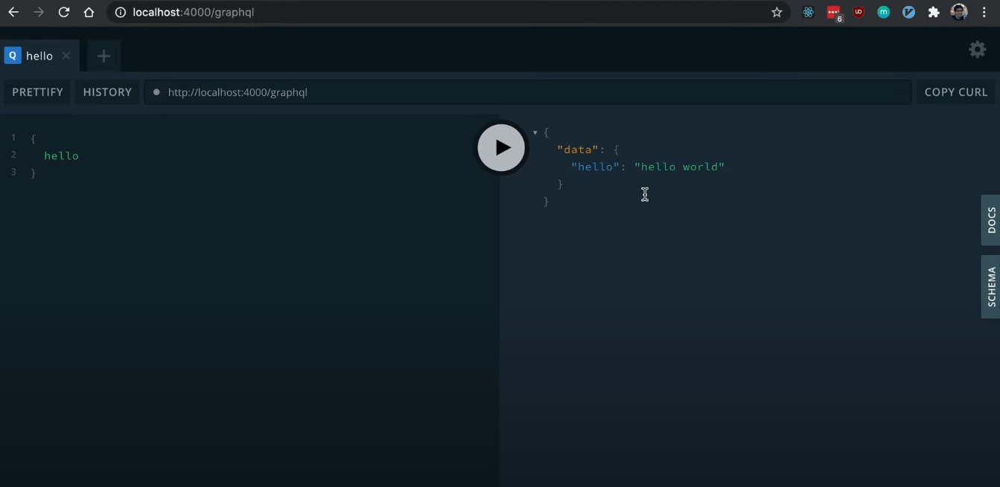

# 05\. GraphQL 

#graphql#apolloserver#express#entity#backend

* * *

⁠

```javascript
yarn add express apollo-server-express graphql type-graphql 
yarn add reflect-metadata
yarn add -D @types/express
```

**index.ts**

```javascript
import "reflect-metadata"; // needed for GraphQL to infer the types
```

  

- express is the server that is going to be used
- apollo-server-express allows us to use graphql or create a grapqhl endpoint easily
- graphql and type-graphql for the schema
- @types/express installs the ts types for express servers since they’re not in-built
- **GraphQL runs on backend server** \- accessed on localhost:4000 (configured in MikroORM step)

  

* * *

## Initial setup of Express server   

index.ts

```javascript
const app = express();

app.get('/', (req, res) => {
    res.send("hello")
})

app.listen(4000, () => {
    console.log("server started on localhost:4000");
  }); 
```

  

- and now that the express server is set up, ⁠we should see “hello” at localhost:4000 

  

* * *

## Adding GraphQL endpoint with Apollo and defining a “hello” resolver

**index.ts**  

```javascript
const app = express();

const apolloServer = new ApolloServer({
  schema: await buildSchema({
    resolvers: [HelloResolver],
    validate: false,
  }),
});

apolloServer.applyMiddleware({ app })

app.listen(4000, () => {
  console.log("server started on localhost:4000");
}) 
```

**resolvers/hello.ts**

```javascript
import { Query, Resolver } from "type-graphql";

@Resolver()
export class HelloResolver {
  @Query(() => String) // declare what the query returns (uppercase in typegreaphql)
  hello() {
    return 'hello world'
  }
}
```

  

- and now we have the localhost:4000 /graphql endpoint as follows:

  

  

* * *

## Convert the [Post entity](04. Entity - Post.ts.md "upnote://x-callback-url/openNote?noteId=a8402bee-274f-41d7-a3f7-958d472d439c&elementId=8dcf3161-c816-47aa-87bd-7cb0d33a253e") (class) to a GraphQL type:    

#### 

- **We use** @ObjectType() and @Field attributes and Types imported from type-graphql package as follows.
- @Field is added to only those columns we want to expose to the GraphQL schema, so the data in them can be retrieved and displayed

  

**entities/Post.ts** 

```javascript
import { Entity, PrimaryKey, Property } from "@mikro-orm/core";
import { Field, Int, ObjectType } from "type-graphql";

@ObjectType() // graphQL
@Entity() // mikro-orm
export class Post {
  @Field(() => Int)
  @PrimaryKey()
  id!: number;

  @Field(() => String) // explicitly set type for GraphQL
  @Property({ type: 'date' }) // explicitly set type for MikroORM
  createdAt = new Date();

  @Field(() => String)
  @Property({ type: 'date', onUpdate: () => new Date() })
  updatedAt = new Date();

  @Field()
  @Property({ type: 'text'})
  title!: string;
}
```

  

- If the type is not explicitly set in @Field(), we might get a NoExplicitTypeError, (e.g., in createdAt and updatedAt)

* * *

## Adding Context to the Apollo Server 

- We create a `MyContext` type
- ExtendedRequest is implemented to extend Request to include { userId: number }

**types.ts**

```javascript
import { EntityManager, IDatabaseDriver, Connection } from "@mikro-orm/core";
import { Request, Response } from "express";
import { Session, SessionData } from "express-session";
import { Redis } from "ioredis";

interface ExtendedRequest extends Request {
  session: Session &
    Partial<SessionData> &
    Express.Request & { userId: number };
}

export type MyContext = {
  em: EntityManager<IDatabaseDriver<Connection>>;
  req: ExtendedRequest;
  res: Response;
  redis: Redis; // to be added during (11)
};
```

  

- We modify the apolloServer implementation to include the `context`
- Here the context is providing to the resolvers the `orm.em` code as `em` (to interact with the DB) as well as the `redis` storage, which is defined here: 

  

```javascript
const apolloServer = new ApolloServer({
    schema: await buildSchema({
      resolvers: [HelloResolver, PostResolver, UserResolver],
      validate: false,
    }),
    context: ({ req, res }: MyContext) => ({ em: orm.em, req, res }), // context is shared with all resolvers
  });
```

  

- And now we can implement [06\. Resolver - post.ts](06. Resolver - post.ts.md)